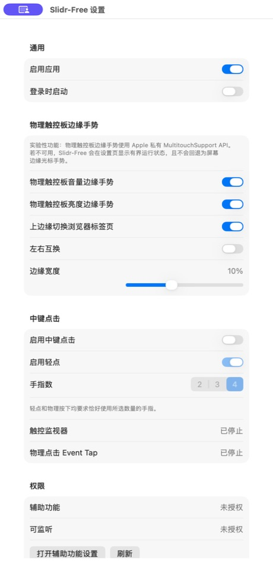
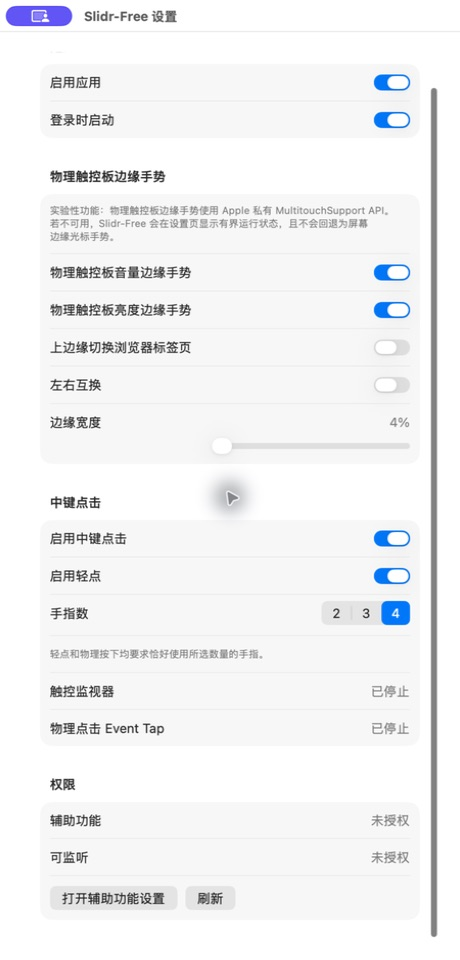
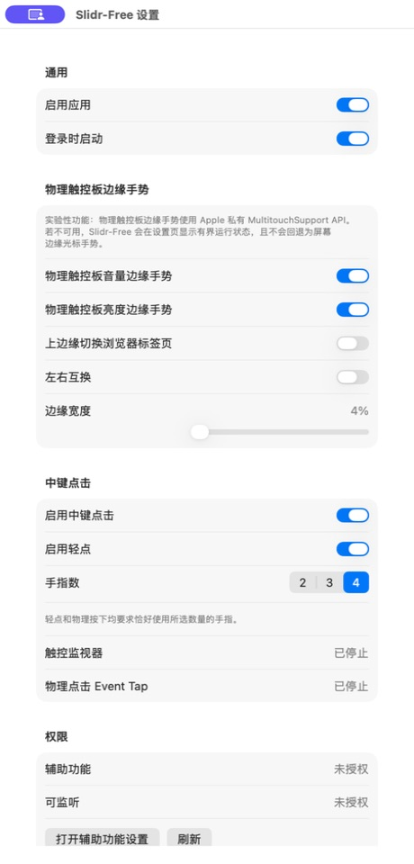

# Slidr Free v0.4 产品优化 PRD

- **日期：** 2026-07-15（2026-07-18 增补四角快捷启动能力）
- **状态：** 已批准并实现（个人开源项目精简范围）
- **目标版本：** v0.4.0
- **基线版本：** v0.3.0（构建号 3001）
- **主题：** 首次可用、状态可解释、手势可验证、四角快捷启动

## 1. 结论摘要

Slidr Free 当前的手势识别和输入管线已经具备较好的工程基础：设置可迁移、异常时默认放行普通输入、生命周期和中键事件配对有较完整的自动化测试。当前最需要优化的不是继续增加手势数量，而是补齐用户从“安装”到“确认手势正常工作”的闭环。

当前体验的核心问题是：**界面显示功能已开启，但权限或输入管线未就绪时，用户仍可能得到“没有任何反应”的结果，而且原因和下一步操作藏在长页面底部。** 这会直接损害用户对应用可靠性和安全性的判断。

v0.4 围绕四件事交付：

1. 新用户首次启动时进入引导，不在未授权状态下静默运行。
2. 将权限、硬件兼容性和输入管线合并为一个可解释的整体健康状态。
3. 将“功能开关 + 左右互换”改为直接的边缘动作映射，并提供无副作用的手势测试。
4. 支持为物理触控板四个角分别绑定一个本地 App，通过单指双击角点快速启动。

## 2. 产品背景与约束

Slidr Free 是 macOS 菜单栏工具，面向希望通过物理触控板边缘手势控制亮度、音量、浏览器标签页，并可选启用多指中键点击的用户。

现有主要能力：

- 左右边缘上下滑动控制亮度和音量；
- 上边缘左右滑动切换 Safari、Chrome、Edge 标签页；
- 左、右、上边缘可分别配置每一步所需的移动距离；
- 精确 2、3 或 4 指轻点/物理按下触发中键；
- 四个角点可分别绑定本地 App，并通过单指双击启动；
- 登录时启动；
- 辅助功能权限检测；
- 私有 `MultitouchSupport` 不可用或 Event Tap 降级时安全停止；
- 简体中文和英文界面。

必须保留的技术约束：

- 物理触控板触摸坐标依赖 Apple 私有 `MultitouchSupport`，无法承诺所有 macOS 与硬件组合长期兼容；
- 当前仅使用默认物理触控设备，不在 v0.4 枚举或路由多个设备；
- Quartz 鼠标事件无法可靠标识来源设备，中键物理按下仍需保留现有限制说明；
- 应用为 `LSUIElement` 菜单栏应用，不依赖 Dock 入口；
- v0.3 设置必须无损迁移；
- 不引入账号、云同步或默认遥测。
- 项目没有 Apple 开发者账号；v0.4 以源码和明确标注的 ad-hoc 开发包为交付形式，不承诺已签名、公证的公共二进制包。
- 替换 ad-hoc 构建可能导致 macOS 重新确认辅助功能权限，界面和 README 必须保留恢复指导。

## 3. 本轮审计范围与方法

### 3.1 审计范围

本轮审计覆盖：

- 首次运行默认状态；
- 设置页的信息架构；
- 辅助功能权限与输入管线状态；
- 菜单栏入口所提供的状态与操作；
- 设置迁移和诊断状态对用户体验的影响。

不在本轮证据范围内：

- 不同真实触控板硬件上的手势成功率；
- VoiceOver 完整任务测试；
- 键盘遍历与焦点顺序的端到端验证；
- 多显示器、外接鼠标和外接触控板的完整组合测试；
- 菜单栏弹出菜单截图。状态栏项目在本轮捕获工具中无法稳定保存，因此该部分依据源码核对，不将其作为截图证据。

### 3.2 验证结果

- `swift test`：113 项测试全部通过，0 失败；
- 当前设置页、权限阻塞状态和隔离偏好的首次运行状态均已从本次构建捕获；
- 为捕获设置窗口，临时审计副本仅在 `/tmp` 中自动打开设置；生产源码未因此修改。

## 4. 当前流程审计

### 步骤 1：启动与入口——健康度：需改进

当前应用启动后只创建菜单栏项目，不自动打开设置，也没有首次运行引导。菜单仅包含启用/停用、设置和退出。用户无法在菜单中判断权限是否缺失、触控监视器是否可用或功能为什么没有响应。

优点：入口简洁，符合常驻菜单栏工具的使用习惯。

风险：首次用户不知道下一步；日常用户也无法一眼区分“已停用”“缺权限”“硬件不可用”和“运行降级”。

### 步骤 2：首次运行默认状态——健康度：高风险

截图显示首次运行时：

- “启用应用”为开启；
- 音量、亮度和浏览器标签页三类边缘手势均默认开启；
- 辅助功能仍为未授权；
- 触控监视器和 Event Tap 显示“已停止”；
- 权限与运行状态位于长页面底部，初始窗口中操作按钮被裁到下缘。

这会形成最严重的预期落差：用户看到多个开关已开启，但手势不会工作，且顶部没有解释或主行动按钮。

### 步骤 3：权限阻塞与运行状态——健康度：高风险

当前页面只把状态平铺为“辅助功能 未授权”“可监听 未授权”“触控监视器 已停止”“物理点击 Event Tap 已停止”。

主要问题：

- “已停止”没有说明是正常未启用、等待权限、启动失败还是正在恢复；
- 权限、触摸监视器与 Event Tap 分散在不同分组，用户需要自己推理因果关系；
- `Event Tap` 属于实现术语，不适合作为普通用户的主要状态名称；
- 已存在的 `frameworkAvailable`、`deviceAvailable`、`lastFailureReason` 和最后触摸帧时间没有进入界面；
- `promptForAccessibility()` 已实现，但当前按钮直接打开系统设置，没有先触发系统授权提示；
- 状态主要依赖灰色次级文字，视觉优先级不足。

### 步骤 4：日常配置——健康度：一般

优点：

- 使用原生 SwiftUI 表单、开关、分段选择器和滑块；
- 2 指冲突与 3 指拖移已有针对性提示；
- 中文文案基本完整；
- 中键相关依赖控件会在总开关关闭时禁用；
- 设置即时保存，迁移与取值范围有测试保护。

主要问题：

- 通用、边缘手势、中键、运行状态和权限全部堆在一个纵向长表单中；
- “亮度开关 + 音量开关 + 左右互换”要求用户在脑中计算最终映射；
- 没有触控板示意、操作方向、实时识别反馈或测试入口；
- 运行状态埋在中键分组中，即使只使用边缘手势也不易发现；
- 高级技术说明占据较多首屏空间，但关键阻塞状态反而在底部；
- 设置损坏时会静默恢复默认值，已有 `lastLoadDiagnostic` 未展示给用户。

### 可访问性风险

从截图和辅助功能树可以确认，大部分原生控件具备可读标签和值，这是现有优势。但仍需专门验证：

- 灰色说明文字与状态文字在不同显示器和辅助显示设置下的对比度；
- 状态不能只依赖颜色，应同时提供图标、文本和行动；
- 完整键盘遍历、焦点顺序、默认按钮和返回焦点；
- VoiceOver 是否能将“问题—原因—解决按钮”作为连续语义组读取；
- 窗口缩放或较大系统文字下是否仍需过度滚动；
- 动态状态变化是否通过辅助技术公告。

截图本身不能证明 WCAG 或 macOS 可访问性完全合规。v0.4 要求使用原生控件、文本语义和不抢焦点的状态更新；完整 VoiceOver 任务测试在工具和志愿者资源具备时执行，不作为个人开源版本的发布阻塞项。

## 5. 优化机会排序

| 优先级 | 优化项 | 用户价值 | 实现成本 | 主要依据 |
| --- | --- | --- | --- | --- |
| P0 | 首次运行与权限闭环 | 极高 | 中 | 当前默认开启但不可运行 |
| P0 | 统一健康状态与可恢复动作 | 极高 | 中 | 底层已有状态，界面未利用 |
| P1 | 设置页信息架构重组 | 高 | 中 | 单页过长、关键状态埋底 |
| P1 | 直接边缘动作映射 | 高 | 中 | 现有“左右互换”认知成本高 |
| P1 | 无副作用手势测试中心 | 高 | 中高 | 用户无法区分手势不熟与系统故障 |
| P1 | 菜单栏状态与快捷恢复 | 中高 | 低中 | 日常入口没有运行反馈 |
| P1 | 四角双击快捷启动 | 高 | 中 | 高频 App 可直接触达，且能复用现有触控输入管线 |
| P2 | 按应用启用/排除 | 中 | 高 | 适合高级用户，非首次可用阻塞 |
| P2 | 多触控设备枚举与选择 | 中 | 很高/高风险 | 受私有 API 和设备识别限制 |

## 6. v0.4 产品目标

### 6.1 目标

1. 新用户无需阅读 README，也能完成授权并成功验证至少一个手势。
2. 用户在打开菜单或设置后的 3 秒内能判断应用是否正常运行。
3. 每个非正常状态都明确回答“发生了什么、影响什么、下一步做什么”。
4. 用户无需理解“左右互换”即可确认每条边对应的动作。
5. 现有 v0.3 用户设置和手势行为无损迁移。
6. 用户可以为任意角点选择或清除一个本地 App，并在不干扰边缘滑动的前提下通过双击启动。

### 6.2 非目标

- 不重写现有中键状态机；角点双击以独立、可测试的状态机接入现有输入管线；
- 不承诺用公开 API 替代 `MultitouchSupport`；
- 不在 v0.4 支持多设备路由；
- 不解决 Quartz 鼠标事件来源设备无法可靠识别的问题；
- 不加入账号、云同步、默认遥测或广告；
- 不以 Mac App Store 上架为目标；
- 不在本版本实现完整的按应用启用/排除规则；只支持每个角点绑定一个启动目标。
- 不提供 Developer ID 签名、Apple 公证、Mac App Store 或自动更新；这些能力需要未来单独取得 Apple 开发者资源后重新立项。

## 7. 目标用户与核心任务

### 7.1 用户类型

**新用户**：从 GitHub 下载应用，知道想要“边缘调音量/亮度”，但不了解辅助功能、私有触控框架或 Event Tap。

**日常用户**：已经配置完成，希望菜单栏工具安静运行；只有失效时才打开设置排查。

**高级用户**：会调整边缘宽度和中键手指数，愿意查看诊断详情并提交可复现问题。

### 7.2 用户任务

- 我想快速知道这台 Mac 是否支持 Slidr Free；
- 我想授权后立刻确认手势被识别；
- 我想清楚看到左、右、上边缘各自做什么；
- 我想把常用 App 绑定到四个角，并通过双击快速启动；
- 当手势失效时，我想知道是权限、硬件、功能关闭还是运行故障；
- 我想在不误触系统操作的情况下调整边缘宽度和手指数。

## 8. 目标信息架构

设置窗口改为五个稳定入口，建议使用原生 macOS 侧栏或顶部标签，窗口默认尺寸约 640 × 560，并允许缩放：

1. **概览**：整体健康状态、启用应用、登录时启动、快速修复、最近识别反馈；
2. **边缘手势**：触控板示意、左/右/上边缘动作、边缘宽度、测试入口；
3. **角点快捷启动**：四角 App 绑定、选择/清除、触控板示意和无副作用测试入口；
4. **中键点击**：总开关、轻点、手指数、冲突提示、测试入口；
5. **诊断**：权限、框架、设备、触摸监视器、物理点击监听、最近失败、版本与复制诊断。

普通用户不应在概览页看到 `Event Tap`、generation 或私有符号等实现术语。诊断页可以保留技术字段，但要同时提供用户可理解的解释。

## 9. 核心需求

### R-01 首次运行引导（P0）

新安装第一次启动时自动打开引导窗口。引导完成前，功能选择可以预配置，但输入管线不开始派发真实系统动作。

引导包含四步：

1. **兼容性检查**：检测私有框架、默认物理触控设备和系统版本；
2. **授予权限**：解释为何需要辅助功能权限并触发系统授权；
3. **选择布局**：展示触控板示意和左/右/上边缘动作；
4. **验证手势**：进入无副作用测试，成功识别一个手势后完成。

规则：

- 新安装默认 `isAppEnabled = false`，完成引导且权限/设备就绪后再开启；
- 用户可“稍后设置”，此时菜单栏必须显示“需要完成设置”，不能伪装为正常运行；
- 用户从系统设置返回应用时自动刷新权限，不要求手动点击“刷新”；
- 已完成引导后不重复出现，除非用户在诊断页选择“重新运行设置向导”。

### R-02 统一健康状态模型（P0）

新增纯逻辑 `AppHealthResolver`，把设置、权限和管线状态归并为单一用户状态。建议状态如下：

| 状态 | 用户文案 | 菜单栏表现 | 主行动 |
| --- | --- | --- | --- |
| `ready` | Slidr Free 正在运行 | 正常图标 | 无 |
| `disabledByUser` | Slidr Free 已暂停 | 弱化/暂停图标 | 启用 |
| `setupRequired` | 需要完成设置 | 提醒图标 | 继续设置 |
| `permissionRequired` | 需要辅助功能权限 | 提醒图标 | 授予权限 |
| `hardwareUnavailable` | 未检测到受支持的物理触控板 | 提醒图标 | 查看兼容性 |
| `starting` | 正在启动手势监听 | 进度状态 | 等待/重新检查 |
| `degraded` | 部分功能不可用 | 警告图标 | 查看并修复 |
| `recovering` | 正在恢复监听 | 进度状态 | 等待 |

解析必须区分“预期未使用”和“异常停止”。例如中键关闭时，物理点击监听应显示“未启用”，而不是“已停止”。

### R-03 权限闭环（P0）

- 主按钮文案为“授予辅助功能权限”；
- 首次点击先调用现有 `promptForAccessibility()`；
- 如果系统没有弹出提示或仍未授权，再提供“打开系统设置”；
- 应用重新激活后自动刷新，并在权限变化时更新健康状态和输入管线；
- 仍未授权时提供简短的三步说明，不要求用户理解 TCC；
- 检测到应用包身份变化或疑似旧 TCC 记录时，诊断页提供“移除旧条目并重新添加当前应用”的指导；
- 不自动修改系统安全设置。

### R-04 设置页重组（P1）

- 概览页首屏必须显示整体状态和唯一主行动；
- 权限与故障不再放在页面最底部；
- 技术性实验说明收进“兼容性说明”折叠区；
- 只有诊断页显示底层组件名称；
- 设置保存失败、登录项注册失败或设置损坏恢复时显示持久但不阻塞的错误横幅；
- 提供“恢复默认设置”，执行前明确列出会被重置的项目并要求确认。

### R-05 直接边缘动作映射（P1）

用三个直接选择器替代四个间接开关：

- 左边缘：亮度 / 音量 / 无；
- 右边缘：亮度 / 音量 / 无；
- 上边缘：浏览器标签页 / 无。

界面同步显示触控板示意、滑动方向和结果：

- 左/右边缘向上：增加；向下：减少；
- 上边缘向右：下一个标签页；向左：上一个标签页。

若左右两侧选择同一系统动作，允许保存，但显示轻量提示，避免误认为系统自动去重。

### R-06 无副作用手势测试（P1）

边缘手势测试模式：

- 进入测试后 15 秒内识别触摸，但不派发亮度、音量或标签切换系统动作；
- 实时显示“检测到左边缘 / 向上 / 亮度 +1”等反馈；
- 显示边缘命中区域，帮助调整宽度；
- 成功后提供触感反馈和可见确认；
- 超时后区分“没有触摸帧”“触摸未命中边缘”“方向/距离未达到阈值”。

中键测试模式：

- v0.4 只验证所选手指数的放置与轻点识别；
- 测试期间不发送真实中键事件，也不启用物理点击转换；
- 物理按下的真实转换仍通过正常功能手工验证，不在测试模式中模拟。

安全要求：退出测试、切换页面、睡眠、权限丢失或应用退出时，测试会话必须立即结束，不能把待处理动作带回正常管线。

### R-07 菜单栏状态与快捷恢复（P1）

菜单结构建议：

1. 不可点击的状态摘要，例如“状态：需要辅助功能权限”；
2. 主行动，例如“完成设置…”或“查看并修复…”；
3. 启用/暂停 Slidr Free；
4. 设置…；
5. 退出。

图标至少区分正常、暂停和需要注意三种状态，且不能只依赖颜色。菜单状态必须随权限、设置和管线变化刷新，而不只是随设置变化刷新。

### R-08 诊断与问题恢复（P1）

诊断页显示：

- 应用整体健康状态；
- 辅助功能权限；
- `MultitouchSupport` 框架是否可用；
- 默认物理触控设备是否可用；
- 触摸监视器状态；
- 中键物理点击监听状态；
- 最近一次触摸帧距今时间；
- 最后一次有界失败原因；
- 应用版本、构建号、macOS 版本和架构；
- “重新检查”和“复制诊断摘要”。

复制摘要要求：

- 默认不包含用户名、完整文件路径、正在使用的应用、输入内容或触摸坐标；
- 失败原因继续限制长度并只允许已知枚举/安全文案；
- 在复制前展示将复制的文本。

### R-09 可访问性与本地化（P0）

- 所有新状态同时包含文字，不仅使用颜色或图标；
- 主行动具有明确、唯一的按钮标签；
- 健康卡片按“状态—影响—行动”组织为连续的辅助功能语义；
- 键盘可完成首次引导、设置修改、测试开始/结束和恢复操作；
- 焦点不会在状态自动刷新时被抢走；
- 动态健康状态变化使用适度的可访问性公告；
- 简体中文和英文字符串在同一 PR 中更新；
- 技术术语只出现在诊断层，并提供用户语言解释；
- 窗口允许缩放且主行动位于稳定布局中；较大文字和 VoiceOver 的完整人工矩阵属于非阻塞社区验证项。

### R-10 四角双击快捷启动（P1）

用户可以为物理触控板的左上、右上、左下、右下四个角分别配置一个本地 macOS App，或保持“未配置”。双击角点时，目标 App 不在前台则打开或激活；目标 App 已经是前台 App 时，则在最小化和恢复其当前焦点窗口之间切换。设置即时保存，应用暂停、权限缺失、输入管线停止或角点未绑定时不得执行任何 App 动作。

配置要求：

- 使用原生 App 选择面板，只接受 `.app` 应用包；
- 每个角点独立显示已绑定 App 的名称，并提供“选择 App…”“更换…”和“清除”；
- 持久化 App 的 Bundle Identifier、显示名称和所选路径；启动时优先按 Bundle Identifier 解析当前位置，路径仅作为回退，以兼容 App 被移动或更新；
- 仅当系统当前前台 App 的 Bundle Identifier 与绑定值完全一致时进入窗口切换分支；目标 App 仅仅处于运行中但不在前台时，仍按正常启动流程激活；
- 当前窗口未最小化时，通过辅助功能接口优先触发焦点窗口左上角的最小化按钮；按钮元素不可用时可设置同一窗口的最小化属性；
- 当前窗口已经最小化时，下一次合格双击必须取消该窗口的最小化状态并将其抬升，从而避免 App 仍保持前台身份时连续进入无效的最小化分支；
- 焦点窗口不可用时尝试同一 App 的主窗口；两者均不可用时，可从同一进程的窗口列表恢复已最小化窗口；没有可切换窗口时安全失败，不重新打开 App，也不改为操作其他进程的窗口；
- App 无法找到或系统拒绝打开时安全失败，不尝试执行 Shell 命令，不自动修改权限，也不改为打开任意同名文件；
- 角点绑定不进入诊断摘要，避免复制本地 App 路径。

手势判定：

- 手势必须由单指完成，两次轻点都必须从同一个角点区域开始；
- 角点区域由现有 `edgeWidthPercent` 决定，即横向和纵向边缘区域的交集；四角共用该区域大小，不新增难以解释的原始范围参数；
- 每次轻点最长 0.30 秒，单次轻点最大移动距离为触控板归一化对角距离 0.015；该值低于边缘滑动最小步进 0.02；
- 第二次轻点必须在第一次抬起后的 0.40 秒内开始，并在第二次抬起时触发一次；
- 多指、触点 ID 在单次轻点内变化、时间戳倒退、明显移动、触摸从角外开始、两次角点不同、取消帧或管线重建都会取消候选；
- 一次合格双击最多产生一个启动动作，不因后续空帧重复触发。

冲突与安全：

- 角点轻点移动量低于边缘滑动最小触发距离，不应同时产生亮度、音量或标签页动作；
- 从角点开始的连续滑动一旦超过轻点移动阈值，角点候选失效，现有边缘滑动继续按原规则识别；
- 任意安全测试模式都在统一派发边界拦截 App 动作；角点测试只显示识别到的角点，不真实打开、激活、最小化或恢复 App；
- 中键精确多指手势与角点单指双击互斥，多指帧不得被降级解释为角点轻点；
- App 选择、清除和自动迁移必须支持简体中文、英文、键盘操作和 VoiceOver 可读标签。

## 10. 关键流程

### 10.1 新用户首次运行

1. 启动应用，自动显示设置向导；
2. 检查框架和设备；
3. 用户点击“授予辅助功能权限”；
4. 从系统设置返回后自动识别授权成功；
5. 用户确认边缘映射；
6. 进入测试，完成一次被识别但不执行系统动作的手势；
7. 用户完成设置，应用进入 `ready`；
8. 后续启动只驻留菜单栏。

### 10.2 日常失效恢复

1. 菜单栏图标进入需要注意状态；
2. 菜单摘要说明“需要辅助功能权限”或“未检测到触控板”；
3. 用户选择“查看并修复…”；
4. 概览页直接定位到对应问题与主行动；
5. 修复后健康状态自动恢复，无需重启应用。

### 10.3 调整手势

1. 用户在“边缘手势”直接选择左/右/上动作；
2. 触控板示意即时更新；
3. 用户进入测试，调整边缘宽度；
4. 测试成功后退出；
5. 新设置立即用于正常输入管线。

### 10.4 配置并使用角点快捷启动

1. 用户进入“角点快捷启动”；
2. 在某个角点点击“选择 App…”，从原生面板选择一个 `.app`；
3. 页面显示 App 名称，触控板示意同步标记该角点；
4. 用户运行无副作用角点测试，确认同一角点双击可以被识别但不会打开、最小化或恢复 App；
5. 退出测试后在该角点完成单指双击；
6. 第二次抬起时执行 App 切换：目标 App 不在前台则打开或激活；目标 App 已在前台时，未最小化窗口执行最小化，已最小化窗口执行恢复并抬升；
7. 用户可随时更换或清除绑定，变更立即生效。

## 11. 数据模型与迁移

### 11.1 新字段建议

- `experience.onboardingVersion: Int`；
- `edgeAssignments.left: none | brightness | volume`；
- `edgeAssignments.right: none | brightness | volume`；
- `edgeAssignments.top: none | browserTabs`。
- `cornerAppBindings.topLeft/topRight/bottomLeft/bottomRight: ApplicationBinding?`；
- `ApplicationBinding.bundleIdentifier/displayName/applicationPath: String`。

继续使用现有设置键并采用可选字段解码，避免破坏 v0.3 数据。`AppHealthResolver` 为派生状态，不持久化。

### 11.2 v0.3 边缘设置迁移

当新映射字段缺失时，按现有行为计算：

- 左边缘：若 `swapSides == false`，由 `brightnessEdgeGesture` 决定亮度/无；否则由 `volumeEdgeGesture` 决定音量/无；
- 右边缘：若 `swapSides == false`，由 `volumeEdgeGesture` 决定音量/无；否则由 `brightnessEdgeGesture` 决定亮度/无；
- 上边缘：由 `browserTabEdgeGesture` 决定浏览器标签页/无。

迁移后必须与 v0.3 的每一种开关组合行为一致，并加入全组合测试。

### 11.3 引导迁移

- 新安装、无现有设置键：`onboardingVersion = 0`，显示引导；
- 已存在 v0.3 设置：视为已使用用户，不强制进入引导；首次打开新设置页时显示一次可关闭的“新的状态与测试功能”提示；
- 用户可从诊断页主动重跑引导；
- 设置损坏恢复默认值时，不静默处理：显示“设置已恢复为默认值”横幅和诊断入口。

### 11.4 角点绑定迁移

- 旧设置缺少 `cornerAppBindings` 时解码为空绑定，不改变任何既有手势；
- 新安装默认四角均未配置，不自动猜测或绑定 App；
- 任意一个角点存在有效绑定时，视为“已配置手势”，即使三条边和中键均关闭，物理触摸管线仍可按正常权限规则启动；
- 空 Bundle Identifier、空显示名称、非绝对路径或非 `.app` 路径的损坏绑定在校验时移除，不允许形成不可执行的半绑定状态；
- 保存新设置后只写入结构化角点字段，不修改既有边缘、中键和体验字段。

## 12. 成功指标

本版本不要求加入线上遥测，也不要求招募固定数量的可用性测试参与者。发布前以可重复的自动化证据和当前开发 Mac 上的可用烟测为准：

### 12.1 发布前

- 隔离偏好域中的首次启动自动显示向导，完成前不派发真实动作；
- 左、右、上边缘的直接映射和 v0.3 全组合迁移由自动化测试覆盖；
- 四角双击的成功、超时、移动、多指、跨角、取消和单次派发由自动化测试覆盖；
- App 绑定的旧设置默认、往返持久化、损坏清理、启动目标解析、前台匹配以及窗口最小化/恢复分支由自动化测试覆盖；
- 安全测试的统一派发门保证亮度、音量、标签页和中键动作均不会发出；
- “暂停”“未配置手势”“缺权限”“硬件不可用”“启动中”“恢复中”和“降级”均由状态表测试覆盖；
- 100% 的非正常健康状态有唯一推荐行动；
- 完整测试、核心检查、开发包版本/许可证/归档复验和中英文资源校验通过。

### 12.2 发布后

- 与“安装后没反应”“授权后仍不工作”“升级后重新授权”相关的问题占比下降；
- 诊断摘要能够让维护者在首次回复时判断权限、硬件或管线类别；
- v0.3 升级用户没有设置丢失或左右动作反转报告。

## 13. 验收标准

### 13.1 功能验收

1. 新安装首次启动自动进入引导，未完成前不派发真实手势动作。
2. 用户可完成兼容性检查、授权、映射选择和一次无副作用测试。
3. 概览页和菜单栏对同一运行状态给出一致文案。
4. 缺权限、硬件不可用、应用暂停、启动中、恢复中和降级均可区分。
5. 中键关闭时，物理点击监听显示“未启用”，不显示故障式“已停止”。
6. 权限变化后应用自动刷新并在条件满足时恢复管线。
7. 左/右/上边缘映射可直接配置，v0.3 所有旧组合迁移后行为不变。
8. 测试模式不会改变音量、亮度、浏览器标签页或发送中键事件。
9. 测试模式结束、睡眠、权限丢失和退出后没有残留会话或延迟动作。
10. 设置损坏恢复、登录项失败和运行降级都有用户可见反馈。
11. 四个角点可以分别选择、更换和清除一个 App，未配置角点不会产生启动动作。
12. 同一角点的合格单指双击只在第二次抬起时产生一个 App 切换动作。
13. 多指、超时、跨角、明显移动、触摸取消和管线重建不会启动 App。
14. 角点安全测试显示识别反馈但不会真实打开、激活、最小化或恢复 App；从角点开始的边缘滑动仍可正常识别。
15. 绑定 App 已是前台 App 时，连续合格双击可以在最小化和恢复其焦点窗口之间切换；其他 App 在前台时仍打开或激活绑定 App，窗口切换失败时不回退为重新打开。

### 13.2 可访问性验收

1. 仅用键盘可以完成首次设置和问题恢复。
2. 每个状态、影响和推荐行动使用原生文本与组合语义，不依赖自绘图形传达关键信息。
3. 状态不只依赖颜色。
4. 自动状态更新不抢焦点，关键变化有适度公告。
5. 中英文字符串完整，窗口可缩放，主按钮位于固定的向导底栏或页面内容区。

### 13.3 工程与发布验收

1. 现有完整测试套件通过。
2. 新增 `AppHealthResolver` 状态表测试和优先级冲突测试。
3. 新增 v0.3 全组合边缘映射迁移测试。
4. 新增首次运行、已有用户、设置损坏三类持久化测试。
5. 新增测试模式不派发系统动作的回归测试。
6. 新增四角双击状态机、角点绑定迁移、动作派发、App 启动解析、前台匹配和窗口最小化/恢复分支测试。
7. 开发包明确标注为 ad-hoc，验证版本、构建号、Bundle ID、许可证和归档内容。
8. README 和诊断页保留单默认设备、私有框架、ad-hoc 权限恢复等已知限制；其他 macOS 和外接触控板由社区按需验证，不阻塞 v0.4。

## 14. 里程碑建议

### M1：状态基础（约 1 个开发周期）

- `AppHealthResolver`；
- 权限闭环；
- 菜单栏状态；
- 概览页健康卡片；
- 设置损坏反馈；
- 状态与迁移测试。

### M2：首次可用与设置重组（约 1–2 个开发周期）

- 首次引导；
- 新信息架构；
- 直接边缘映射；
- 无副作用测试；
- 中英文与可访问性验收。

### M3：开发包质量（可与 M1/M2 并行）

- ad-hoc 开发包版本、Bundle ID、许可证和归档复验；
- CI 自动运行核心检查、完整测试和开发包验证；
- v0.3 设置迁移全组合测试；
- README 明确源码/开发包定位和权限恢复步骤。

### M4：四角快捷启动增补

- 四角 App 绑定数据模型与旧设置迁移；
- 单指双击角点状态机及与边缘手势的冲突测试；
- 原生 App 选择/清除界面和触控板角点示意；
- 统一动作派发、App 解析/启动、前台窗口最小化/恢复和无副作用角点测试；
- 中英文文案、README、核心检查与发布包复验。

v0.4.0 一次性交付 M1、M2 和上述轻量 M3；2026-07-18 增补 M4。增补不为了缺失的 Apple 开发者资源推迟产品体验，也不扩大到通用自动化或按应用规则引擎。

## 15. 风险与缓解

| 风险 | 影响 | 缓解 |
| --- | --- | --- |
| 私有框架在新系统失效 | 核心手势不可用 | 启动兼容性检查、明确状态、保持安全降级 |
| 健康状态优先级错误 | 界面给出错误修复建议 | 状态解析做成纯函数并覆盖完整组合表 |
| 测试模式误派发动作 | 造成音量/亮度/标签或点击误操作 | 在动作派发前设置统一 preview gate，并做负向测试 |
| 迁移改变左右动作 | 老用户习惯被破坏 | 对 v0.3 四个开关的全组合做迁移等价测试 |
| 自动刷新造成焦点跳动 | 影响键盘和 VoiceOver | 状态更新与导航/焦点解耦，不自动切页 |
| 诊断泄露本地信息 | 降低隐私信任 | 使用字段白名单、预览后复制、不记录输入内容和触摸坐标 |
| 角点双击误触发 | 意外切换前台 App | 限制为单指、同角、短时、低移动的两次完整轻点，并在第二次抬起时单次派发 |
| App 被移动、更新或删除 | 绑定失效 | 优先按 Bundle Identifier 重新解析，路径仅回退；失败时安全停止且保留可重新选择入口 |
| 最小化后 App 仍保持前台身份 | 再次双击重复最小化而无法恢复窗口 | 读取窗口的最小化状态；已最小化时执行取消最小化并抬升窗口 |
| 前台 App 无焦点窗口或窗口不可切换 | 双击没有可执行目标 | 仅尝试同一进程的焦点窗口和主窗口；失败时安全停止，不重新打开或影响其他窗口 |
| 角点与边缘滑动冲突 | 调节动作或启动动作异常 | 轻点移动阈值低于边缘步进；明显移动立即取消角点候选并保留边缘识别 |

## 16. 后续版本候选

以下需求有价值，但不应阻塞 v0.4：

- 按应用启用/排除边缘手势或中键；
- 多设备枚举、设备选择和设备级状态；
- 灵敏度/步进预设，而不是暴露更多原始阈值；
- 如果未来取得 Apple 开发者资源，再单独评估签名、公证和自动更新；
- 可导入/导出的本地配置；
- 更完整的硬件兼容性数据库。

## 17. 决策建议

建议批准以下产品方向：

1. v0.4 的主线仍优先保证首次可用与可诊断性；四角双击作为边界明确、可测试的增补能力接入；
2. 新安装在引导完成前不真正启用输入动作；
3. 用直接边缘映射替代“左右互换”；
4. 将无副作用手势测试作为核心体验，而非隐藏调试功能；
5. v0.4 只承诺源码和明确标注的 ad-hoc 开发包，不把当前无法获得的 Apple 开发者资源设为完成门槛。
6. 四角能力只负责打开/激活用户明确选择的本地 App，或切换其当前前台焦点窗口的最小化状态，不演变为 Shell 命令、脚本或通用自动化入口。
